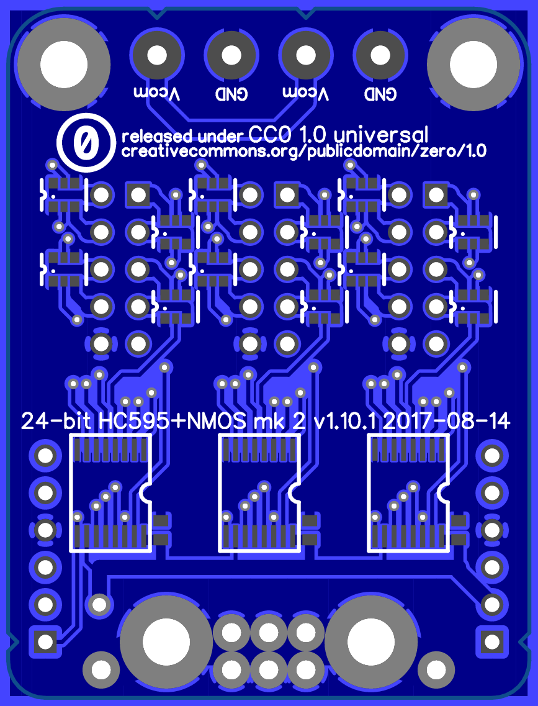

HC595+NMOS 24-bit parallel-out shift registers with current sink N-channel MOSFET outputs
=========================================================================================

This is a design for an augmented breakout for three 74HC595 serial-in/parallel-out 8-bit shift registers in TSSOP-16 packages (specifically, 74HC595PW), with added N-channel dual MOSFETs in SC70-6 packages (2N7002DW, one per two output pins).

Features
--------

*   Decoupling capacitors on board.
*   2 × pair application power terminals, each with a `Vcom` terminal and a `GND` terminal.
    *   Screw terminals are provided to allow thicker wire, such as speaker wire, to be used without special preparation.
    *   The `Vcom` terminals are designed for connecting a positive supply voltage, such as the supply for a common-anode LED display.
        *   The `Vcom` bus connects to pin 9 of each output header.
        *   Each `Vcom` terminal is marked with a notch on the edge of the board.
    *   The `GND` terminal connects to the board's ground, allowing an additional conductor for ground return.
        *   The `GND` bus also connects to the logic ground of the host and guest ports.
        *   The `GND` bus connects to pin 10 of each output header.
    *   Two pairs are provided, one for input and one for passthrough, to facilitate chaining multiple boards.
*   3 × 10-pin output header, each providing connections to 8 output pins.
    *   Pins 1 through 8 correspond to Q0 through Q7 from the shift register.
    *   Pin 9 is connected to the `Vcom` bus.
    *   Pin 10 is connected to the `GND` bus.
*   The outputs are not run directly from the 74HC595 pins but via an N-channel MOSFET gated by each pin. The outputs are thus sink-only but can handle a greater amount of current (2N7002DW max ~230mA, SQ1922EEH max ~840mA).
*   The host-side 6-pin header provides power, serial, and blanking inputs to the board, while the compatible guest-side 6-pin header provides serial outputs and passed-through power and blanking outputs to the host-side header of another breakout (or to another 74HC595-based or similar assembly).
*   Pre-fab and some-assembly-required options for cables for the header connectors are readily available.

Parts list
----------

*   3 × 74HC595PW parallel-out shift register (TSSOP-16)
*   12 × 2N7002DW dual N-channel MOSFET (SC70-6, pin order `S1 G1 D2 S2 G2 D1`)
*   2 × 6-pin header (100-mil centers)
*   3 × 10-pin boxed header (100-mil centers)
*   2 × 2-position screw terminal with 0.200in centers
*   3 × 0.1µF capacitor (0603)

License
-------

> Designed 2016-2017 by Peter S. May (http://psmay.com/).
>
> To the extent possible under law, the author(s) have dedicated all copyright and related and neighboring rights to these design and layout documents to the public domain worldwide. This content is distributed without any warranty.
>
> You should have received a copy of the CC0 Public Domain Dedication along with this software. If not, see <http://creativecommons.org/publicdomain/zero/1.0/>.
